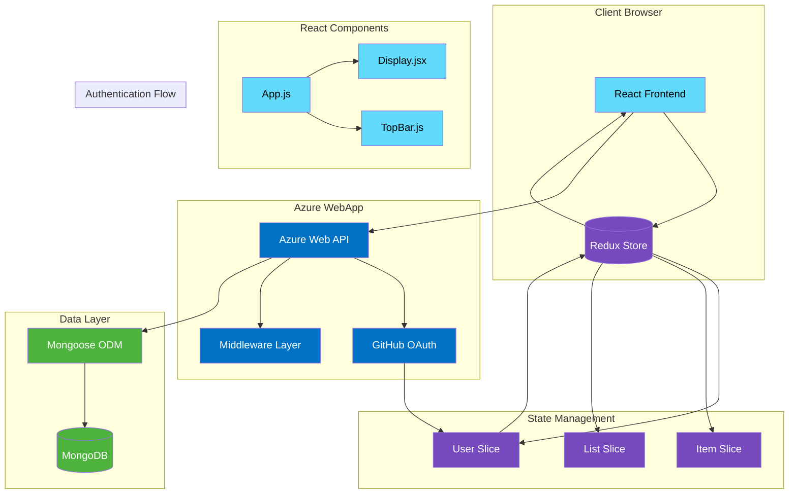

# Work Schedule Management System

근무 일정 관리를 위한 웹 애플리케이션입니다. React와 MongoDB를 사용하여 구현된 이 시스템은 Azure WebApp 환경에서 실행됩니다.

## 주요 기능

- 📅 대화형 캘린더 인터페이스
- 👥 근무자 관리 (추가/삭제/수정)
- 🔄 교대 근무 일정 관리 (주간/야간)
- 🔐 GitHub OAuth 기반 인증
- 📱 반응형 디자인

## 시스템 아키텍처



## 기술 스택

- **Frontend**: React.js
- **상태 관리**: Redux (with @reduxjs/toolkit)
- **스타일링**: Tailwind CSS
- **인증**: GitHub OAuth
- **백엔드**: Azure WebApp
- **데이터베이스**: MongoDB (with Mongoose)

## 시작하기

### 사전 요구사항

- Node.js (v14 이상)
- MongoDB
- Azure 계정
- GitHub 계정 (인증용)

### 설치

1. 저장소 클론
```bash
git clone https://github.com/sinwoowoo/oss2-mongoose.git
cd oss2-mongoose
```

2. 의존성 설치
```bash
npm install
```

3. 환경 변수 설정
```bash
cp .env.example .env
```
`.env` 파일을 열고 필요한 환경 변수를 설정하세요:
```
REACT_APP_GITHUB_CLIENT_ID=your_github_client_id
REACT_APP_API_URL=your_azure_webapp_url
MONGODB_URI=your_mongodb_uri
```

4. 개발 서버 실행
```bash
npm start
```

## 배포

### Azure WebApp 배포

1. Azure Portal에서 새 Web App 생성
2. 배포 설정 구성
3. GitHub 저장소 연결
4. 환경 변수 설정

자세한 배포 가이드는 [위키](../../wiki)를 참조하세요.

## 프로젝트 구조

```
oss2-mongoose/
├── src/
│   ├── app/
│   │   └── store.js
│   ├── features/
│   │   ├── items/
│   │   ├── lists/
│   │   └── user/
│   ├── components/
│   │   ├── App.js
│   │   ├── Display.jsx
│   │   └── TopBar.js
│   └── index.js
├── public/
└── package.json
```

## 기여하기

1. Fork the Project
2. Create your Feature Branch (`git checkout -b feature/AmazingFeature`)
3. Commit your Changes (`git commit -m 'Add some AmazingFeature'`)
4. Push to the Branch (`git push origin feature/AmazingFeature`)
5. Open a Pull Request

## 라이선스

이 프로젝트는 MIT 라이선스로 배포됩니다. 자세한 내용은 [LICENSE](LICENSE) 파일을 참조하세요.

## 연락처

신우우 - [@sinwoowoo](https://github.com/sinwoowoo)

프로젝트 링크: [https://github.com/sinwoowoo/oss2-mongoose](https://github.com/sinwoowoo/oss2-mongoose)

## 참고사이트
static webapp :  [https://www.azurestaticwebapps.dev/collections/dab](https://www.azurestaticwebapps.dev/collections/dab)
big calendar : [https://jquense.github.io/react-big-calendar/examples/?path=/story/about-big-calendar--page](https://jquense.github.io/react-big-calendar/examples/?path=/story/about-big-calendar--page)

***
***

# Static Web Apps - Mongoose starter

This template is designed to be a starter for creating [React](https://reactjs.org) apps using [Azure Static Web Apps](https://docs.microsoft.com/azure/static-web-apps/overview?WT.mc_id=academic-45074-chrhar), with [Azure Cosmos DB API for Mongo DB](https://docs.microsoft.com/azure/cosmos-db/mongodb/mongodb-introduction?WT.mc_id=academic-45074-chrhar) as a database and a [Mongoose](https://mongoosejs.com/) client. It's built with the following:

- Azure resources
  - [Azure Static Web Apps](https://docs.microsoft.com/azure/static-web-apps/overview?WT.mc_id=academic-45074-chrhar)
  - [Azure Cosmos DB API for Mongo DB](https://docs.microsoft.com/azure/cosmos-db/mongodb/mongodb-introduction?WT.mc_id=academic-45074-chrhar)
- Application libraries
  - [React](https://reactjs.org/) and [Redux Toolkit](https://redux-toolkit.js.org/)
  - [Mongoose](https://mongoosejs.com/)
  - [Azure Functions](https://docs.microsoft.com/azure/azure-functions/functions-overview?WT.mc_id=academic-45074-chrhar)
- Development libraries
  - [Azure Static Web Apps CLI](https://docs.microsoft.com/azure/static-web-apps/local-development?WT.mc_id=academic-45074-chrhar)

## Azure deployment

Please refer to the [documentation](https://docs.microsoft.com/azure/static-web-apps/add-mongoose?WT.mc_id=academic-45074-chrhar) for information on creating the appropriate server resources and deploying the project.

> **Important**
>
> Two environmental variables are required for the project:
>
> - `AZURE_COSMOS_CONNECTION_STRING`: The connection string to the database server
> - `AZURE_COSMOS_DATABASE_NAME`: The name of the database
>
> These can be stored in [application settings](https://docs.microsoft.com/azure/static-web-apps/add-mongoose?WT.mc_id=academic-45074-chrhar#configure-database-connection-string) in Azure Static Web Apps. When developing locally, the project will default to using MongoDB running on localhost.

## Local development

You can run the project locally using containers by following the [local setup instructions](./local-setup.md).

## Project structure

This starter project is designed to be a template for React with Redux and hosted on Azure Static Web Apps. It uses the [Redux Toolkit](https://redux-toolkit.js.org/). The project is a Todo application using authentication for Azure Static Web Apps. Todo items are collected in lists, and are scoped to individual users. To use the application:

1. Login using GitHub by clicking the login link.
1. Create a list.
1. Create todo items for the list.

### package.json scripts

- **dev**: Starts the SWA CLI, Azure Functions and the React app. The application will be available on [http://localhost:4280](http://localhost:4280)

### src/app

Contains [store.js](./src/app/store.js), which manages global state for the application.

### src/features

Contains three "features", one each for [items](./src/features/items/), [lists](./src/features/lists/) and [user](./src/features/user/). *lists* and *items* contain a [slice](https://redux-toolkit.js.org/api/createSlice) to manage their respective state and a React component.

### api

Root folder for Azure Functions. All [new serverless functions](https://docs.microsoft.com/azure/static-web-apps/add-api?tabs=react#create-the-api?WT.mc_id=academic-45074-chrhar) are added to this directory.

#### api/config

Contains the configuration for the database. Two environmental variables are required for the project:

- `AZURE_COSMOS_CONNECTION_STRING`: The connection string to the database server
- `AZURE_COSMOS_DATABASE_NAME`: The name of the database

These can be stored in [application settings](https://docs.microsoft.com/azure/static-web-apps/add-mongoose?WT.mc_id=academic-45074-chrhar#configure-database-connection-string) in Azure Static Web Apps. When developing locally, the project will default to using MongoDB running on localhost. You can change the default values by updating *default.json*.

#### api/models

Contains the two Mongoose models, TodoItemModel and TodoListModel. It also contains *store.js*, which exposes helper functions for [CRUD](https://en.wikipedia.org/wiki/Create,_read,_update_and_delete) operations.
